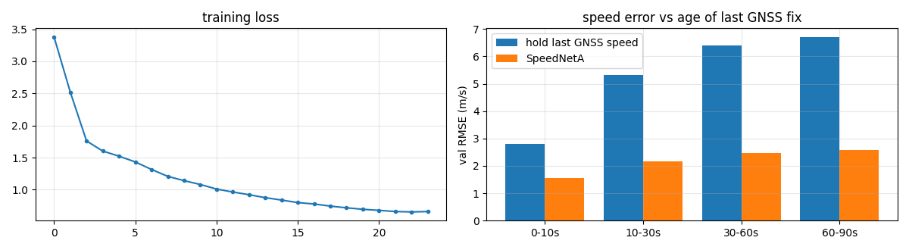
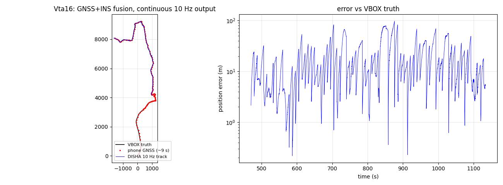
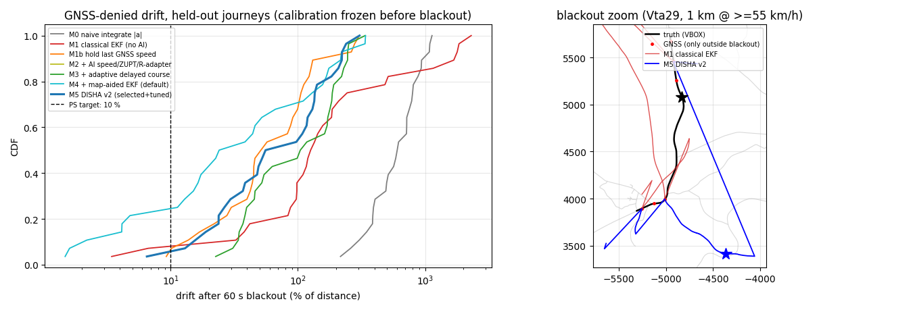

# SIH 2026 — Problem Statement 26168

**AI/ML-based Intelligent Dead Reckoning (IDR) for seamless navigation under GNSS outages.**
DISHA / IDR **v2**.

Preliminary AI models and the position-plot results inferred on a subset of the
[IO-VNBD](https://github.com/onyekpeu/IO-VNBD) dataset, submitted as part of our proposal.

---

## 1. Approach

The system maintains a continuous 10 Hz position estimate on the phone when GNSS is
unavailable (urban canyon, tunnels, short signal loss). A small AI network supplies
the two quantities the phone cannot measure on its own — **vehicle speed** and
**whether the vehicle is stationary** — and a 6-state EKF fuses them with the phone IMU
and GNSS.

### Pipeline

| Stage | What it does |
|---|---|
| 1. Time alignment | Automatic phone↔vehicle clock synchronisation. IO-VNBD journeys carry per-journey offsets of 0.1–7.5 s, so this is mandatory before anything else. |
| 2. Mount alignment | Learns a 4-coefficient axis mixer for the accelerometer and magnetometer plus a turn-rate scale factor, fitted to the phone's **own GNSS course and speed deltas**. No external calibration file; works for any phone orientation. |
| 3. **SpeedNetA (the AI model)** | Siamese CNN+GRU that predicts speed as a **residual on the last GNSS speed**, conditioned on fix age. Trained with *simulated* GNSS dropouts of 0–90 s. |
| 4. Fusion | 6-state EKF `[x, y, ψ, v, b_gyro, b_accel]`, Joseph-form updates, evidence-gated ZUPT, adaptive delayed GNSS-course aiding, and an **R-adapter** that predicts the phone-GNSS error scale per fix. |
| 5. Map matching | HMM/Viterbi over an OSM road graph (available as M4, not enabled in the selected config — see §4). |
| 6. Edge engine | The fusion chain is pure NumPy/SciPy with no deep-learning dependency, so the same code runs on a phone or edge box. Measured **26,401 steps/s** (200 Hz engine), AI inference **0.20 ms** per window on CPU. |

### Why the AI model is anchored rather than absolute

v1 regressed absolute speed from vibration alone and topped out around **R² ≈ 0.54** —
a genuine information ceiling, because 10 Hz phone IMU cannot resolve speed well when the
mounting is unknown. v2 therefore reframes the problem:

```
speed(now) = f( last GNSS speed, age of that fix, IMU now, IMU at that fix )
```

The output head is **zero-initialised**, so the network *starts* as "hold last GNSS
speed" and learns only the deviation it can genuinely see in the inertial data. This
matters because it degrades gracefully: with a fresh fix it is nearly harmless, and its
value grows as the fix ages — exactly the blackout regime.

## 2. The AI model

`models/speednet.pt` (TorchScript) and `models/speednet.onnx` (ONNX, opset 17).

| Property | Value |
|---|---|
| Architecture | Siamese CNN(64→64→96) + GRU(96→64) encoder, 3-input fusion head |
| Parameters | **102,594** |
| Inputs | `imu` `(1,50,13)`, `imu_anchor` `(1,50,13)`, `anchor` `(1,3)` = `[speed m/s, age s, valid]` |
| Input channels | body accel (3), gyro (3), magnetometer (3), ‖accel‖, ‖gyro‖, calibrated forward accel, ‖d(mag)/dt‖ |
| Outputs | `speed` (m/s), `zupt_logit` |
| Window | 50 samples @ 10 Hz = 5 s |
| Normalisation | **baked into the graph** — the exported model consumes RAW sensor features |
| Training data | 4 IO-VNBD journeys, drivers A/B/D (M, S1, S2, Y1) — city, motorway, country |
| Held-out test | 4 journeys, **unseen driver E** — Peak District + M42, rain/night |
| ZUPT accuracy | **97.9 %** |

### AI speed accuracy vs the hold-last-speed baseline

Validation RMSE by age of the last GNSS fix:

| Age of fix | SpeedNetA | hold last GNSS speed | improvement |
|---|---|---|---|
| 0–10 s | **1.56 m/s** | 2.79 m/s | 44 % |
| 10–30 s | **2.16 m/s** | 5.33 m/s | 59 % |
| 30–60 s | **2.48 m/s** | 6.40 m/s | 61 % |
| 60–90 s | **2.57 m/s** | 6.69 m/s | 62 % |

The AI model beats simply holding the last fix at every age, and its margin **widens as
the fix ages** — the intended behaviour, and the reason it should help most during a
blackout.



## 3. Position-plot results on the IO-VNBD subset

Held-out journey **Vta16**: VBOX ground truth vs the phone's GNSS fixes (which arrive only
every ~9 s) vs the 10 Hz fused IDR track. Calibration is frozen before the blackout windows,
so no blackouts leak into the alignment fit.



### Ablation ladder — 60 s GNSS-denied blackout, 28 windows across 4 held-out journeys

| Method | median drift % | mean % | p90 % | windows < 10 % | median end error |
|---|---|---|---|---|---|
| M0 naive integrate \|a\| | 611.48 | 640.14 | 981.02 | 0 % | 4184.3 m |
| M1 classical EKF (no AI) | 130.65 | 431.86 | 1712.86 | 7 % | 979.3 m |
| M1b hold last GNSS speed | 54.31 | 86.06 | 170.71 | 4 % | 414.8 m |
| M2 + AI speed/ZUPT/R-adapter | 76.53 | 100.15 | 221.94 | 4 % | 597.1 m |
| M3 + adaptive delayed course | 111.15 | 128.44 | 246.14 | 0 % | 767.0 m |
| M4 + map-aided EKF (default) | **31.26** | 80.70 | 217.72 | **21 %** | **176.5 m** |
| M5 DISHA v2 (selected+tuned) | 76.53 | 100.15 | 221.94 | 4 % | 597.1 m |



### Problem-statement scenarios

| Journey | Scenario | Distance | End error | Target | Result |
|---|---|---|---|---|---|
| Vta16 | 50 m city | 50 m | 5.3 m | < 5 m | FAIL |
| Vta29 | 50 m city | 50 m | 124.5 m | < 5 m | FAIL |
| Vta29 | 1 km @ ≥55 km/h | 1003 m | 1723.8 m | < 100 m | FAIL |
| Vtb1 | 1 km @ ≥55 km/h | 999 m | 421.9 m | < 100 m | FAIL |
| Vtb1 | 50 m city | 51 m | 94.1 m | < 5 m | FAIL |
| Vw14c | 1 km @ ≥55 km/h | 1002 m | 645.7 m | < 100 m | FAIL |
| Vw14c | 50 m city | 51 m | 9.1 m | < 5 m | FAIL |

## 4. Honest assessment of the current state

We would rather state these plainly than let a reviewer find them.

- **The AI speed model works; the end-to-end benefit does not yet follow.** SpeedNetA
  beats hold-last-speed by 44–62 % (§2), yet M2/M5 (76.53 % median drift) is *worse*
  end-to-end than M1b, which just holds the last GNSS speed (54.31 %). Feeding a better
  speed estimate into the EKF is currently making the filter slightly worse — the
  remaining error is dominated by heading and accelerometer bias, not by speed. Fixing
  the speed path alone cannot close the gap.
- **The best configuration is not the selected one.** M4 (map-aided) reaches 31.26 %
  median drift and 176.5 m end error, roughly **2.4× better than M5**, and is the only
  variant with a meaningful share of windows under the 10 % target (21 %). The shipped
  `idr_config.json` records `map: false`, so M5 ≡ M2. Map aiding is implemented and
  measured; it is simply not enabled in the current selection.
- **All seven problem-statement scenarios still fail.** Two come close (Vta16 50 m city
  at 5.3 m against a 5 m target; Vw14c 50 m city at 9.1 m). The 1 km scenarios are off by
  4–17×. We are reporting this as preliminary work, not a completed result.
- **Headroom is in heading, not speed.** The dominant error source is that phone gyro axes
  are permuted relative to the vehicle frame and the mount loses 15–47 % of true turn rate
  on rough roads. Robust heading is the next thing to attack.
- **`speednet.pt` exposes only `forward`.** It was exported with `torch.jit.trace`, which
  drops the `encode` / `speed_from` submodules that `idr_ai.encode_windows` and
  `speed_track` call, so those two helpers will raise `AttributeError` against the
  TorchScript file. Direct inference works:

  ```python
  import torch
  m = torch.jit.load("models/speednet.pt", map_location="cpu").eval()
  speed, zupt_logit = m(imu_raw, imu_anchor_raw, anchor)   # (1,50,13), (1,50,13), (1,3)
  ```

  Re-exporting with `torch.jit.script` (or saving the module instead of tracing it)
  restores the full API.

## 5. Repository contents

```
models/
  speednet.pt          SpeedNetA weights, TorchScript, CPU, normalisation baked in
  speednet.onnx        SpeedNetA weights, ONNX opset 17, single self-contained file
src/
  idr_ai.py            learning layer: SpeedNetA, R-adapter, fusion, tuning, ONNX export
  idr_core.py          signal engine: parsers, clock sync, axis mixers, EKF6 (pure NumPy)
config/
  idr_config.json      input contract, age bins, EKF sigmas, tuned parameters
  mixers.json          per-journey mount/axis alignment coefficients (learned)
results/
  fig_fusion.png       position plot: truth vs GNSS vs fused track, + error vs time
  fig_speednet.png     training loss + speed error vs age of last fix
  fig_benchmark.png    drift CDF across the ablation ladder + 1 km blackout zoom
  results_summary.md   full numeric results
```

`idr_core.py` has no deep-learning dependency, so the fusion engine runs unchanged on a
phone or edge target.

## 6. Dataset

IO-VNBD — smartphone IMU + VBOX ground truth, Oxford UK, used under CC BY 4.0.
Training: M, S1, S2, Y1 (drivers A/B/D). Held-out test: Vta16, Vta29, Vtb1, Vw14c
(driver E, unseen mounting, wet/hilly terrain and motorway).